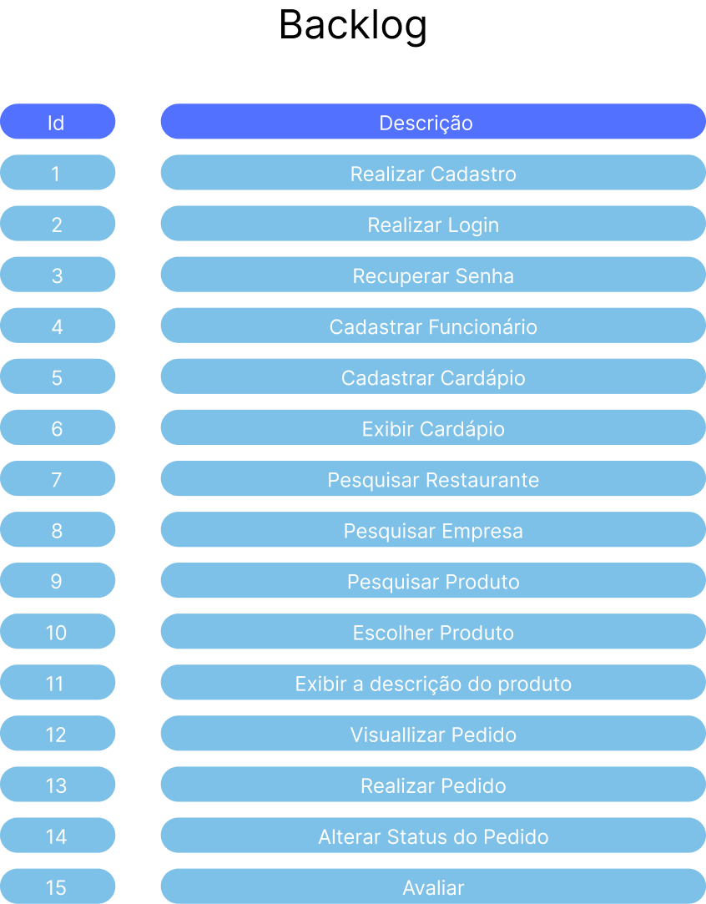

# Projeto Integrador FoodClub

#### [Sobre](#-Sobre) | [Backlogs & User Stories](#-backlogs--user-stories) | [Protótipo & Documentação](#protótipo-e-documentação) | [Links Uteis](#links-uteis) | [Tecnologias](#%EF%B8%8F-tecnologias-utilizadas) | [Equipe](#-equipe)

## 📑 Sobre

O projeto visa criar uma plataforma que facilite a comunicação entre restaurantes, pequenas e médias empresas.

---

### 🎯 **Objetivo**

Criar uma plataforma que facilite a comunicação entre restaurantes e empresas, permitindo que donos de empresas e funcionários escolham facilmente onde desejam pedir o almoço.

### 🚀 **Funcionalidades**

* **Lista de Chamada**: Funcionários escolhem suas opções de almoço diretamente do menu online do restaurante.

* **Múltiplas Opções de Restaurantes**: Empresas podem escolher entre diversos restaurantes parceiros.

* **Prazos e Preços Negociados**: Empresas podem fechar contratos com restaurantes para garantir preços melhores em pedidos frequentes.

* **Visibilidade para Restaurantes**: Plataforma serve como vitrine online para restaurantes expandirem sua base de clientes.

---
 
### 🧰 **Recursos**

* **Lista de Chamada**: Lista de chamada para seleção de opções do menu do restaurante escolhido.

* **Opção de Prazos Maiores**: Opção de fechar prazos maiores com o mesmo restaurante para garantir preços melhores.

---

### **Metodologia**

> Projeto baseado na metodologia ágil SCRUM, procurando desenvolver a Produtividade e Colaboração entre as empresas, os restaurantes e os funcionários.

Um membro da nossa equipe enfrenta dificuldades diárias para fazer o pedido de marmitex para o almoço, causando perda de tempo e estresse.

A partir desta ideia, o aplicativo utiliza de uma API desenvolvida para cadastrar produtos, funcionários, empresas, e restaurantes sendo permitida a consulta, inclusão, mudança e exclusão de cada um.

---

### 📌 Status do Projeto: ⏳ Em Andamento

---

## 🏁 Entregas de Sprints

| Sprint | Previsão | Status | Histórico |
| --- | --- | --- | --- |
| 01 | 01/08/2024 | Concluído | [ver relatório](https://github.com/alinnecardoso/DocumentacaoFoodClub/tree/main/sprints/sprint01) |
| 02 | 05/09/2024 | Concluído | [ver relatório](https://github.com/alinnecardoso/DocumentacaoFoodClub/tree/main/sprints/sprint02)|
| 03 | 10/10/2024 | Concluído | [ver relatório](https://github.com/alinnecardoso/DocumentacaoFoodClub/tree/main/sprints/sprint03)|
| 04 | 14/11/2024 | Concluído | [ver relatório](https://github.com/alinnecardoso/DocumentacaoFoodClub/tree/main/sprints/sprint04) |

---

## 🎬 Apresentação Final
Confira a seguir uma demonstração das funcionalidades para cada tipo de usuário do sistema:

  
Empresa

  Tela da Empresa

  
Restaurante

  Tela do Restaurante

  
Funcionário

  Tela do Funcionário

---

## 👷 Backlogs & User Stories

---

## Protótipo e Documentação

### 🏠 Protótipo 

Com base nos dados coletados em pesquisas, foi possível montar um protótipo de alta fidelidade com o uso da ferramenta Figma. Esta ferramenta possibilitou uma visualização prévia do front-end do projeto, o suficiente para obter o alinhamento entre a equipe de desenvolvimento e o cliente. Desta forma, o projeto prototipado possui algumas funções básicas de acesso a telas e respostas a cliques em botões, posteriormente sendo funcionalidades aplicadas na própria aplicação. O acesso ao protótipo pode ser feito [aqui](https://www.figma.com/design/KVKl4BrJ0W2aGKfArKYART/Esbo%C3%A7o-projeto-foodClub?node-id=0-1&t=wTcwWUv2qAJQYsXa-1)

### 📄 Documentação

As documentações deste projeto possuem mais detalhes do planejamento e da arquitetura do software. Elas podem ser acessadas pelos links: [Documentação do projeto](https://github.com/user-attachments/files/17894084/Projeto.Interdisciplinar.-.FoodClub.pdf) E [Documentação ihc](https://www.figma.com/proto/4uxN0iR5oVJuGYjuRZjTRc/PII---teste?node-id=44-14&t=S29QzT4LJsbFp4Ll-1).

#### ⚙️ Documentação Técnica - Execução Local do Projeto

Este subtópico contém instruções específicas para desenvolvedores que desejam executar o projeto localmente. Inclui:

- Etapas de instalação de dependências
- Migrações e seeders
- Inicialização do backend
- Dados de login de usuários de teste para cada tipo (restaurant, company, employee)

🔗 Acesse aqui a documentação técnica completa:  
[📂 execucao-local.md na branch `docs`](https://github.com/alinnecardoso/DocumentacaoFoodClub/tree/rules)

---

> ## Links Uteis
> * [Link do sistema funcional](https://food-club-9b38.vercel.app/)
> * [Repositório do projeto](https://github.com/Bruno-Pasqual/foodClub)

---

## 🛠️ Tecnologias Utilizadas

  

---

## 👥 Equipe

| Função | Nome | GitHub |
| --- | --- | --- |
| Product Owner | Alinne Martins Cardoso |  |
| Scrum Master | Bruno Henrique Pasqual |  |
| Dev | Maycon Sanches B. de Moura |  |
| Dev | Pietro Adrian R. Da Silva |  |
| Dev | Rafael Martins Cardoso |  |

## 🪪 Licença

The MIT License (MIT) 2024
