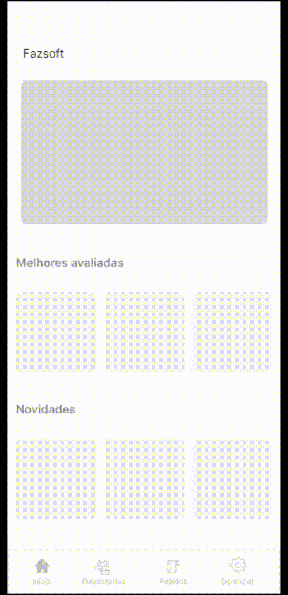

<h1 align="center">Sprint 2: 31/10/2024 a 22/11/2024</h1>

    <a href="#objetivos">🎯 Objetivos da Sprint</a> &nbsp |&nbsp &nbsp
    <a href="#entregas">✅ Entregas</a> &nbsp |&nbsp &nbsp
    <a href="#metricas">📊 Métricas do Time</a> &nbsp |&nbsp &nbsp
    <a href="#links">🔗 Links Úteis</a>

---

  
## 🎯 Objetivos desta Sprint

Na **segunda sprint**, o objetivo é organizar a documentação completa do projeto no Github, incluindo informações sobre os integrantes, sprints, backlogs, users stories e links úteis, além de desenvolver a Página Inicial com navegação acessível para todos os usuários.

---
Os principais requisitos desta sprint foram: 
- **Documentar no Github:**
  - Tarefa: 
    - Criar o Readme
    - Incluir nomes dos integrantes do grupo
    - Criar os Sprints
    - Incluir as Gifs da apresentação final do sistema
    - Backlogs
    - Users Stories
    - Adicionar o link do figma dentro da parte referente ao protótipo
    - Adicionar o link para download da documentação (formato .doc e doc de IHC)
    - Links úteis como link dos sitema funcional e do repositório do Github
    - Definir a função de cada integrante do grupo
- **Acesso à pagina Inicial:**
  - Critério de aceitação: A navegação deve segiur as diretrizes de acessibilidade (WCAG), permitindo navegação por teclado e suporte a leitores de tela.
  - Tarefa: 
    - Garantir que a navegação do sistema seja acessível para todos os usuários, incluíndo aqueles que tenham alguma deficuldade e ou deficiencia.

        
## ✅ Entregas
As seguintes atividades foram realizadas durante esse sprint:  

### 📌 **Documentação do Github**
---
1. **README Completo:**  
   - Adicionado o nome dos integrantes do grupo.
   - Documentação das sprints com objetivos e resultados.
   - Criação de backlogs e user stories com detalhes para cada etapa.
   - Inclusão de GIFs da apresentação final do sistema e links úteis (Figma, sistema funcional, repositório Github).
   - Disponibilização para download da documentação geral e de IHC (em formato .doc).

### 📌 **Frontend:**
---
1. **Página Inicial:**  
   - Desenvolvimento da página inicial com navegação estruturada e responsiva.  
   - Implementação de diretrizes de acessibilidade, como navegação por teclado e suporte para leitores de tela.

### 📌 **Progresso:**
---
A  documentação foi revisada e validada para garantir consistência e clareza. A Página Inicial foi testada com ferramentas de acessibilidade para asegurar conformidade com os padrões WCAG.

   
👨‍💻 Demonstração

   

       
        
   

   → [Voltar ao topo](#topo)
   

---

## 📊 Métricas do Time

A equipe manteve a divisão clara de responsabilidades:  
- **Frontend:** Desenvolvimento da Página Inicial e testes de acessibilidade. 
- **Documentação:** Oraganização e publicação completa do projeto no Github, com links e recursos para usuários e desenvolvedores. 

---

## 🔗 Links Úteis
- Repositórios:  
  - Frontend: [Acesse aqui](https://github.com/Bruno-Pasqual/foodClub/tree/master/client)  
  - Documentação: [Acesse aqui](https://github.com/Bruno-Pasqual/foodClub)
  - Protótipo: [Acesse aqui](https://www.figma.com/design/KVKl4BrJ0W2aGKfArKYART/Esbo%C3%A7o-projeto-foodClub?node-id=320-2&t=w2j5rkH23OhnuSrM-1)

→ [Voltar ao topo](#topo)

