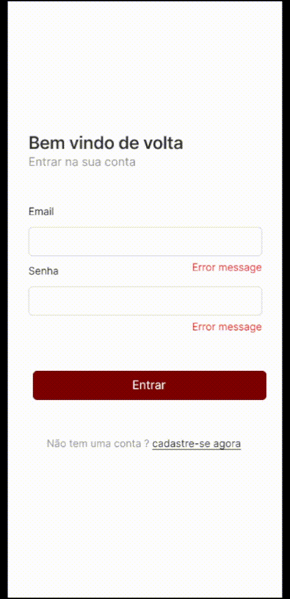

<h1 align="center">Sprint 23: 01/11/2024 a 22/11/2024</h1>

    <a href="#objetivos">🎯 Objetivos da Sprint</a> &nbsp |&nbsp &nbsp
    <a href="#entregas">✅ Entregas</a> &nbsp |&nbsp &nbsp
    <a href="#metricas">📊 Métricas do Time</a> &nbsp |&nbsp &nbsp
    <a href="#links">🔗 Links Úteis</a>

---

## 🎯 Objetivos desta Sprint
Na **terceira sprint**, o o foco foi migrar o frontend de JavaScript para TypeScript, melhorando a qualidade e segurança do código. Além disso, avançamos na integração com o backend, garantindo que os formulários de login e cadastro se comunicassem corretamente com a API, fornecendo feedback apropriado aso usuários.

---
Os principais requisitos desta sprint foram:  
- **[RT01] Migração para TypeScript:**
   - Motivo: Melhorar a qualidade do código e a segurança, com o uso de tipagem estática e recursos avançados.
   - Tarefa: Refatorar os componentes do frontend de JavaScript para TypeScript, assegurando que todo o código atenda os padrões do TypeScript.
- **[RF06] Integração com o Backend para Subimissão do Login:**
    - Descrição: Permitir que os dados do formulário de login sejam enviados ao backend e que o usuário receba feedback apropriado.
    - Critério de Aceitação: Os dados devem ser corretamente transmitidos via API para o servidor, e o feedback de sucesso ou falha da operação deve ser exibido ao usuário.
    - Tarefa: Implementar a integração do formulário de login com o backend utilizando requisição API.
- **[RF07] Integração com o Backend para Submissão do Cadastro:**
    - Descrição: Conectar o formulário de cadastro ao backend, garantindo que os dados sejam enviados corretamente e tratados.
    - Critério de Aceitação: Os dados do formulário devem se enviados ao servidor com sucesso, e o usuário deve receber um feedback sobre o status da operação.
    - Tarefa: Conectar o formulário de cadastro ao backend via API, validando o feedback recebido.

→ [Voltar ao topo](#topo)

---

## ✅ Entregas
As seguintes atividades foram realizadas durante esse sprint:  

### 📌 **Frontend**
---
1. **Migração para TypeScript:** 
   - Refatoração do código base para TypeScript, incluindo componentes principais do projeto.
   - Testes realizados para validar a compatibilidade e funcionalidade do código após a migração.
2. **Integração do Login com Backend:**
    - Conexção do formulário de login com o servidor via API.
    - Exibição de mensagens de sucesso (login bem-sucedido) e falha (credenciais inválidas) para o usuário
3. **Integração do Cadastro com o Backend:**
    - Conexão do formulário de cadastro com o backend via API.
    - Feedback adequado implementado para informar o sucessso ou falha no envio dos dados.
---
### 📌 **Progresso**
Os formulários de login e cadastro foram integrados ao backend e testados para validar a comunicação com a API. A migração para TypeScript trouxe maior clareza e segurança ao código, preparando-o para futura expansoes.

   
👨‍💻 Demonstração

   

       
        
   

   → [Voltar ao topo](#topo)
   

---

## 📊 Métricas do Time

A equipe trabalhou na migração e integração de funcionalidades, com foco nos seguintes aspectos:
- **Frontend:**
    - Refatoração completanpara TypeScript.
    - Integração inicial com as APIs de login e cadastro.
- **Backend:**
    - Validação dos endpoints para login e cadastro, ajustando o retorno das requisições para atender às necessidades do frontend.

---

## 🔗 Links Úteis
- Repositórios:  
  - Frontend: [Acesse aqui](https://github.com/Bruno-Pasqual/foodClub/tree/master/client)  
  - Documentação: [Acesse aqui](https://github.com/Bruno-Pasqual/foodClub)

→ [Voltar ao topo](#topo)
