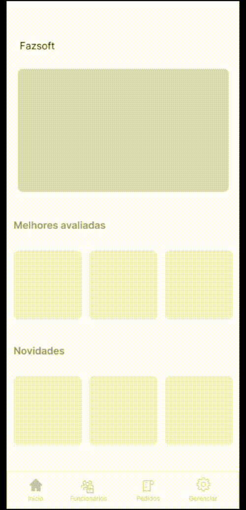

<h1 align="center">Sprint 4: 07/11/2024 a 26/11/2024</h1>

    <a href="#objetivos">🎯 Objetivos da Sprint</a> &nbsp |&nbsp &nbsp
    <a href="#entregas">✅ Entregas</a> &nbsp |&nbsp &nbsp
    <a href="#metricas">📊 Métricas do Time</a> &nbsp |&nbsp &nbsp
    <a href="#links">🔗 Links Úteis</a>

---

## 🎯 Objetivos desta Sprint
Na **quarta sprint**, o objetivo foi desenvolver a navegação entre as páginas, implementar o fluxo de recuperação de senha e ajustar feedbacks ao usuário para ações como login e cadastro, melhorando a usabilidade e funcionalidade do sistema.

---
Os principais requisitos desta sprint foram:  
- **[RF03] Recuperação de Senha:**
   - Descição: Desenvolver o fluxo completo para recuperação de senhas esquecidas, garantindo segurança e usabilidade.
   - Critério de Aceitação: O usuário deve conseguir iniciar o processo de recuperação, validar sua identidade por pergunta de segurança e redefinir sua senha com sucesso.
   - Tarefa:
        - Criar a página de solicitação de recuperação de senha, com campo de email e botão "Recuperar Senha".
        - Validar o email inserido e exibir a pergunta de segurança correspondente.
        - Criar a página de redefinição de senha, com campos para inserir e confirmar a nova senha, além de feedback visual e redirecionamento para login.
- **[RF04] Navegação no Site:**
    - Descrição: Permitir que o usuário navegue intuitivamente entre as páginas do sistema.
    - Critério de Aceitação: Todas as páginas devem conter menus ou links para facilitar a navegação, com conformidade com padões de usuabilidade.
    - Tarefa:
        - Configurar menus e links acessíveis para navegação entre as páginas principais.
        - Realizar testes de usabilidade para validar a eficiência da navegação.
- **Feedback ao Usuário e Redirecionamentos:**
    - Descrição: Fornecer feedback visual e mensagens adequadas para ações críticas, como login e cadastro.
    - Critério de Aceitação: O usuário deve receber mensagens claras sobre o sucesso ou falha de suas ações, e ser redirecionado automaticamente após operações bem-sucedidas.
    - Tarefa:
        - Implementar mensagens de erro ou sucesso para login e cadastro.
        - Configurar redirecionamentos automáticos apropriados após ações bem-sucedidas.

        → [Voltar ao topo](#topo)

---

## ✅ Entregas
As seguintes atividades foram realizadas durante esse sprint:  

### 📌 **Frontend**
---
1. **Recuperação de Senha (RF03):**
    - Página de Solicitação de Recuperação de Senha: Desenvolvida com campo para email e botão "Recuperar Senha", explicando o proxímo passo ao usuário.
    - Validação de Email e Pergunta de Segurança: Criado fluxo para validar o email inserido e exibir a pergunta de segurança correspondente. Mensagens de erro são exibidas para emails não cadastrados.
    - Redefinição de Senha: Página para inserir e confirmar a nova senha, com feedback ao usuário e direcionamento automático para o login após a atualização.
2. **Navegação no Site:**
    - Configuração de menus e links acessíveis, permitindo navegação entre as paginas de forma intuitiva.
    - Testes de usabilidade realizado para verificar a eficiencia da navegação.
3. **Feedback au Usuário e Redirecionamentos:**
    - Implementados feedbacks visuais e mensagens para ações de login e cadastro, com redirecionamentos automáticos apropriados.

### 📌 **Backend**
---
1. **API de Recuperação de Senha:**
    - Endpoints para a validação de email, exibição da pergunta de segurança e atualização da senha.
    - Implementação de lógica para armazenar e validar perguntas de segurança associadas ao usuário.
2. **Interação com Navegação:**
    - Configuração para suporte a rotas dinamicas no backend, garantindo a compatibilidade com a navegação do frontend.

### 📌 **Progresso**
---
O fluxo completo de recuperação de senha foi testado e validado, garantindo segurança e acessibilidade. A navegação foi integrada com sucesso, e os feedbacks de login e cadastro foram ajustados para melhorar a experiência do usuário.

 

   
👨‍💻 Demonstração

   

       
        
   

   → [Voltar ao topo](#topo)
   

---

## 📊 Métricas do Time

A equipe foi dividida entre as areas de **frontend** e **backend**, com responsabilidades claras:  
- **Frontend:** Implementação das páginas e feedbacks visuais. 
- **Backend:** Desenvolvimento de APIs seguras e suporte às funcionalidades do frontend. 

---

## 🔗 Links Úteis
- Repositórios:  
  - Frontend: [Acesse aqui](https://github.com/Bruno-Pasqual/foodClub/tree/master/client)  
  - Documentação: [Acesse aqui](https://github.com/Bruno-Pasqual/foodClub)
  - Protótipo: [Acesse aqui](https://www.figma.com/design/KVKl4BrJ0W2aGKfArKYART/Esbo%C3%A7o-projeto-foodClub?node-id=320-2&t=w2j5rkH23OhnuSrM-1)

→ [Voltar ao topo](#topo)

